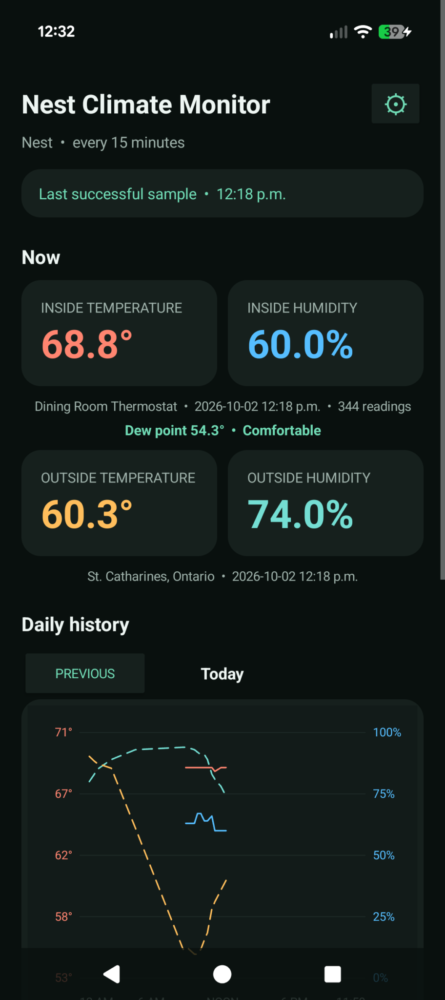
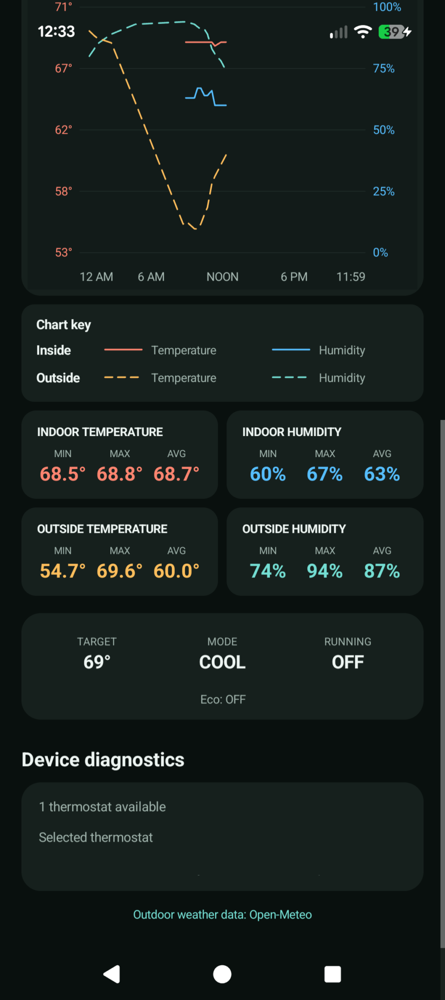
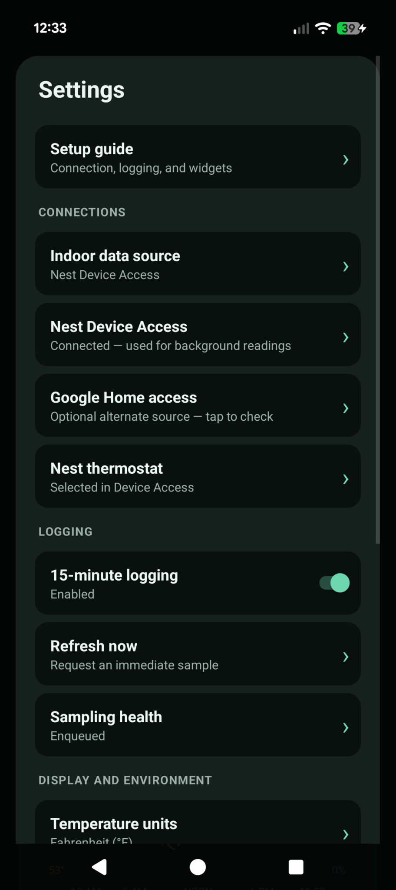
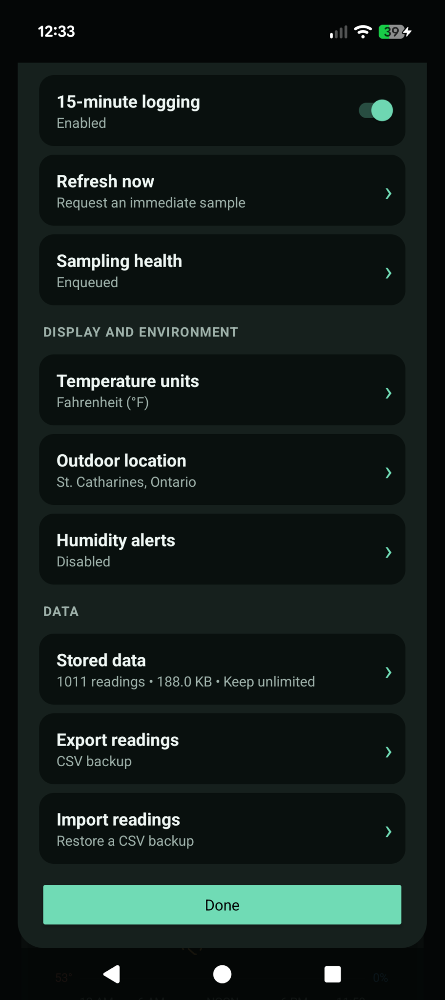

# Nest Climate Monitor

An Android app for tracking Nest thermostat temperature and humidity alongside local outdoor weather, with on-device history, charts, and home-screen widgets. It connects directly to Google without a separate server. It:

- connects directly to Google's Smart Device Management API for reliable screen-off Nest readings;
- alternatively reads through Google Home while the display is on and the phone is unlocked;
- samples in the background every 15 minutes using Android WorkManager, enabled by default with a persistent on/off setting;
- records outdoor temperature and humidity from the Open-Meteo grid for a user-selected location;
- discovers temperature and relative-humidity traits;
- stores readings in an on-device SQLite database;
- graphs stored temperature and humidity readings;
- provides resizable current-reading and six-hour graph widgets;
- exports selected-day or complete history as CSV;
- supports optional sustained high/low humidity notifications;
- calculates dew point, comfort state, and daily min/average/max summaries;
- reports delayed or stale samples, retains a bounded sanitized failure history, and supports a unique manual refresh;
- lets users select a specific compatible indoor device; and
- shows returned climate-device types and traits to diagnose whether a thermostat exposes humidity.

There is no foreground service, developer-operated cloud upload, analytics, or app-server dependency. Android may defer individual runs during Doze or other battery-saving modes, so 15 minutes is the requested interval rather than a wall-clock guarantee. Users can select either Nest Device Access or Google Home as the indoor source; Device Access is the default whenever it is connected and no explicit choice has been saved. Nest Device Access works in the background while the display is off. Google Home readings are attempted only while the display is on and the phone is unlocked, although Nest Climate Monitor itself does not need to remain open or visible.

Opening or returning to the app does not request a sample. Readings are requested only by the independent periodic worker or by **Settings → Refresh now**. A manual refresh does not replace, postpone, or suppress the next periodic worker run.

The daily chart spans midnight through 11:59 PM in the phone's current time zone. Solid lines are readings from the selected indoor source (Nest Device Access or Google Home), and dashed lines are outdoor weather-model readings. Previous and Next navigate among calendar days; Next is hidden on the current day. The outdoor location is selectable in the app, with St. Catharines, Ontario as the non-personal default. Android geocodes the entered place, and only the resulting coordinates are sent to Open-Meteo; Google Home data is never transmitted.

Outdoor weather data is provided by [Open-Meteo](https://open-meteo.com/) under CC BY 4.0. The free endpoint is intended for non-commercial use; review Open-Meteo's current terms before distributing a commercial build.

## Screenshots

| Dashboard | History and daily summaries |
| --- | --- |
| [](docs/screenshots/dashboard.png) | [](docs/screenshots/daily-history.png) |

| Connections and logging | Display, alerts, and stored data |
| --- | --- |
| [](docs/screenshots/settings-connections.png) | [](docs/screenshots/settings-data.png) |

Click a screenshot to view it at full size. Private device identifiers are hidden.

## Install the APK

Download the signed APK from [GitHub Releases](https://github.com/BenK22/NestClimateMonitor/releases). The first release is a prerelease intended for personal sideloading on **Android 10 or newer**. Allow installation from your browser or file manager, then open the APK. Google connection setup is still required; each user supplies their own credentials.

The release includes a SHA-256 checksum, and the public release-signing fingerprint is documented in [docs/RELEASING.md](docs/RELEASING.md) for Google Home Android OAuth setup.

If you already use a development/debug build, export your readings before switching: Android cannot install a differently signed release over it. Switching requires uninstalling the debug build, installing the release, importing the CSV, and reconnecting Google. Updates between official releases use the same signing key and can be installed over the previous release.

## Nest Device Access setup

Device Access is the recommended indoor source because it supports screen-off background readings. Registration has a one-time, non-refundable **US$5 fee per Google account**. Each user supplies their own Google credentials directly on the phone; no credentials are compiled into the APK or repository.

1. Create a **Web application** OAuth client in [Google Auth Platform](https://console.cloud.google.com/auth/clients/) with `https://www.google.com` as an authorized redirect URI.
2. [Enable the Smart Device Management API](https://console.cloud.google.com/apis/library/smartdevicemanagement.googleapis.com) in the same Google Cloud project that owns the OAuth client. If it was just enabled, allow a few minutes for the change to propagate.
3. Register for [Nest Device Access](https://developers.google.com/nest/device-access/registration) and pay Google's one-time, non-refundable US$5 account fee. Create a Device Access project with Events disabled and associate the Web OAuth Client ID with it.
4. Add your Google account as an OAuth test user if required. Google's Nest authorization can expire after about a week; use **3. Connect Nest** to renew it when necessary.
5. In the app, open **Settings → Nest Device Access**, enter the Device Access Project ID, Web Client ID, and rotated Client Secret, then save.
6. Tap **Open Google authorization** and grant access. Google intentionally finishes on `google.com`; tap Chrome's address bar to reveal and copy the complete `google.com/?code=...&state=...` URL, then return to the app. The app imports that one-time URL automatically; bare codes are rejected because they cannot be tied securely to the authorization request.
7. Complete the connection and select a thermostat. The next manual or scheduled sample will use SDM.

**Weekly permission renewal:** Google OAuth refresh tokens for Nest expire after about **7 days** when the OAuth app is in **Testing** mode, even if the app regularly samples. If readings stop because authorization expired, repeat **Settings → Nest Device Access → 3. Connect Nest** and tap **Complete connection** to regenerate the authorization. Keep your saved client credentials and Device Access project ID; they do not need to be regenerated. See [Google's authorization guidance](https://developers.google.com/nest/device-access/reference/errors/authorization).

The client secret, access token, and refresh token are encrypted using Android Keystore, excluded from Android backup/device transfer, hidden from screenshots, and erased through the Device Access screen. They are still credentials held by a native client; this direct-phone design is intended for personal sideloaded use.

## Google Home setup

1. Sign in at the [Home APIs SDK setup page](https://developers.home.google.com/apis/android/sdk) and download the current Android SDK ZIP. This checkout uses SDK 1.10.1 extracted into `.home-sdk-repo`; the required Maven artifacts are `play-services-home` and `play-services-home-types` version `17.1.0`.
2. Create a Google Cloud project and configure its OAuth consent screen.
3. Add the Google account that owns/administers the Google Home as an OAuth test user.
4. Create an **Android** OAuth client for package `ca.humiditylogger` using the SHA-1 of the key used to sign the app.
5. Keep the app unverified for personal testing. Google Home API app registration is not required for testing.

The phone needs current Google Play services. Current Home APIs also expect a supported physical Google Home hub in the structure. Select Google Home under **Settings → Indoor data source** to use this method. Scheduled indoor reads are attempted only while the display is on and the phone is unlocked; the app does not need to be the visible foreground app. Select Nest Device Access instead for reliable screen-off and overnight logging.

## Build

The project requires JDK 17, Android SDK 36, and Android Studio/Gradle capable of Android Gradle Plugin 8.9.3. Open this folder in a current Android Studio, let it install missing SDK components, then run the `app` configuration on the phone.

Install Android SDK Platform 36 and the build tools required by Gradle. Keep your SDK path in the ignored `local.properties` file, or let Android Studio create it. The signed-in Home APIs SDK belongs in the ignored `.home-sdk-repo` directory.

Once those artifacts are installed, build the debug APK with:

```powershell
.\gradlew.bat assembleDebug
```

The APK is written to `app/build/outputs/apk/debug/app-debug.apk`. Enable installation from your browser or file manager, transfer the APK to the phone, and open it to sideload. Builds signed with a different certificate require a matching Android OAuth client and cannot update an installed build signed by another key.

## First run

1. Configure Nest Device Access using the steps above.
2. Optionally configure Google Home as an alternative indoor source.
3. Choose the outdoor location and temperature units.
4. Leave 15-minute logging enabled. Android may delay individual WorkManager runs.
5. Optionally configure humidity alerts, retention, and home-screen widgets.

All history remains on the phone unless the user explicitly shares a CSV. See [PRIVACY.md](PRIVACY.md).

CSV exports include spreadsheet-safe display columns plus encoded companion columns used by Nest Climate Monitor to restore text fields exactly. Older exports without the companion columns remain importable.

## Publishing this repository

Do not commit the downloaded Home APIs SDK ZIP or its extracted Maven repository. They are ignored as `home.android.sdk_*.zip` and `.home-sdk-repo/`; each developer must download the SDK while signed in to Google Home Developers. Local Android SDK paths, Gradle/build output, APK/AAB files, signing keys, environment files, and common secret-property files are also ignored.

The Google Home Android OAuth client ID is associated with the application ID and signing-certificate SHA-1 in Google Cloud; it is not embedded in this project. Device Access project/client identifiers are entered at runtime, and its client secret and tokens must never be added to source, build configuration, screenshots, issues, or documentation.

Local Beads issue records, agent settings, credential files, diagnostic logs, databases, CSV exports, and private history backups are ignored. Keep them on your machine; upload the Git repository contents rather than a ZIP of the entire working folder. The public commit history uses the author's chosen public identity. See [docs/PUBLISHING.md](docs/PUBLISHING.md) for the publication checks and GitHub upload steps.

Release signing and automation are documented in [docs/RELEASING.md](docs/RELEASING.md). Screenshot guidance is in [docs/screenshots/README.md](docs/screenshots/README.md). The project is available under the [MIT License](LICENSE), and user-facing changes are tracked in [CHANGELOG.md](CHANGELOG.md).

Background-worker timing and a repeatable Android battery-accounting procedure are documented in [docs/BATTERY_TESTING.md](docs/BATTERY_TESTING.md).

## Testing safety

`testDebugUnitTest` runs the local test suite. On-device database tests exist only in the isolated `deviceTest` build and run with `connectedDeviceTestAndroidTest`. That build installs as `ca.humiditylogger.devicetest`, so it cannot replace `ca.humiditylogger` or access its readings and preferences. Android tests are disabled for the normal debug and release variants.

## What success looks like

After Device Access authorization, a refresh should show the selected Nest thermostat's temperature and humidity and Sampling Health should identify `Nest Device Access (Google SDM)`. With Google Home selected, diagnostics should contain `RelativeHumidityMeasurement` with a humidity value.

## License

The original project source is licensed under the [MIT License](LICENSE), copyright Benjamin Kar. Third-party SDKs and weather data retain their own licenses and terms. Nest Climate Monitor is an independent project and is not affiliated with or endorsed by Google or Nest.
